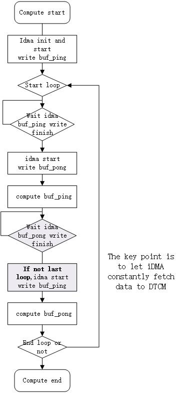

# Example Description

In this example, we perform two different MAC (int_8) computing method:
1. iDMA fetch weight matrix from psram to DTCM (ping-pong buffer)
2. direct compute in psram

The flowchart of the first calculation method is as follows:



Finally, compare the computational speed of these two method.

# HW Configuration

None

# SW Configuration

* Currently, this example projects is not added to the project_dsp by default. Please refer to Application Note: Chapter 2.4 "Add Virtual Folder and Files".  
* You have to link "libxa_nnlib.a" library and the corresponding library path.

# Expected Result

Success log example:

```
INTO dtcm_idma_wr_thread.
 WEIGHT_SIZE:393216, FETCH_SIZE:98304
idma fetch times: 4 
dsp memcpy size: 98304, cycle taken: 118031, speed: 397.
iDMA tranfer size: 98304, cycle taken: 117434, speed: 400.
fc caculation time:5149
cacultaion with iDMA time: 478885 cycles
cacultaion in psram time: 744978 cycles
iDMA fetch and psram result is same ! 
```

Because of the I-cache, we perform twice iDMA compute.
If caculation is successful, the output log will show the cpu cycles taken by different method.

Due to the very very fast MAC(int_8) computation, most of time was taken by psram data fetch. So the iDMA pingpong method would slower than direct compute in psram.
But if you compute some MAC(float) or other slower calculations, iDMA pingpong method may have some improvement.

# Note

* Before using iDMA, the data in cache should be flushed into RAM.
* IDMA source address or destination address must be DTCM. Fetch data between PSRAM or SRAM is not allowed.
* please refer to Xplorer Doc: sys_sw_rm.pdf (Xtensa® System Software): 8. The Integrated DMA Library API

# Supported IC

* AMEBALITE (with DSP core)